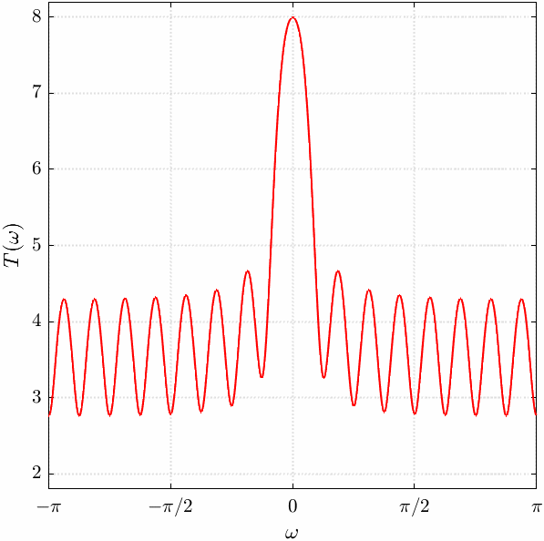

# Jutted-BMOCZ

This repository accompanies our article "Jutted BMOCZ for Non-Coherent OFDM", which proposes a new zero constellation for BMOCZ, called J-BMOCZ, and studies its application to non-coherent OFDM. The repository contains the following:
  1) sample MATLAB functions related to J-BMOCZ, Huffman BMOCZ, and zero stability;
  2) live scripts providing examples of concepts discussed in the paper;
  3) a software-defined radio (SDR) demo based on a BMOCZ-based OFDM waveform.

  <table>
    <tr>
      <td align="center">
         
        (a) Rotating zero pattern.
      </td>
      <td align="center">
         
        (b) Shifting template transform.
      </td>
    </tr>
  </table>
  
  

    <b>Figure 1.</b> J-BMOCZ illustration with $K=16$, $R=1.1$, and $\zeta=1.2$.
  

## References
[1] P. Huggins and A. Şahin, "Jutted BMOCZ for non-Coherent OFDM," soon-to-be submitted.

[2] P. Huggins, A.J. Perre, and A. Şahin, "Fourier-domain CFO estimation using jutted binary modulation on conjugate-reciprocal zeros," in *Proc. IEEE Int. Symp. Pers., Indoor, Mob. Radio Commun. (PIMRC)*, 2025, pp. 1-6.

[3] P. Huggins and A. Şahin, "On the optimal radius and subcarrier mapping for BMOCZ," in *Proc. IEEE Mil. Commun. Conf. (MILCOM)*, 2024, pp. 1-6.

[4] P. Walk, P. Jung, and B. Hassibi, "MOCZ for blind short-packet communciation: Basic principles," in *IEEE Trans. Wireless Commun.*, vol. 18, no. 11, pp. 5080-5097, 2019.

[5] P. Walk, P. Jung, B. Hassibi, and H. Jafarkhani, "MOCZ for blind short-packet communication: Practical aspects," in *IEEE Trans. Wireless Commun.*, vol. 19, no. 10, pp. 6675-6692, 2020.
