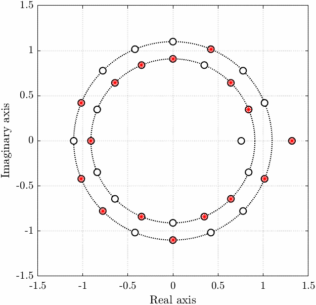
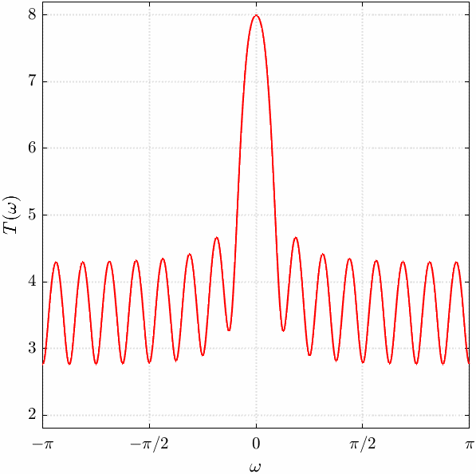

# Jutted-BMOCZ

This repository accompanies the article "Jutted BMOCZ for Non-Coherent OFDM", which proposes an asymmetric zero constellation for BMOCZ, called jutted BMOCZ (J-BMOCZ), and studies its application to non-coherent OFDM. The repository includes the following:
  1) sample MATLAB functions for J-BMOCZ, Huffman BMOCZ, and zero stability analysis (see /functions);
  2) (31,16) and (127,106) affine cyclically permutable code implementations (see /acpcArrays);
  2) MATLAB live scripts covering topics in the references [1]-[4] (see /examples);
  3) a software-defined radio demo of non-coherent OFDM-BMOCZ (see /sdrDemo).

  <table>
    <tr>
      <td align="center">
         
        (a) Rotating zero pattern.
      </td>
      <td align="center">
         
        (b) Shifting template transform.
      </td>
    </tr>
  </table>
  
  

    <b>Figure 1.</b> J-BMOCZ illustration with $K=16$, $R=1.1$, and $\zeta=1.2$.
  

## References
[1] P. Huggins and A. Şahin, "Jutted BMOCZ for non-coherent OFDM," *IEEE Trans. Wireless Commun.*, under review.

[2] P. Huggins, A.J. Perre, and A. Şahin, "Fourier-domain CFO estimation using jutted binary modulation on conjugate-reciprocal zeros," in *Proc. IEEE Int. Symp. Pers., Indoor, Mob. Radio Commun. (PIMRC)*, 2025, pp. 1-6. Available: [https://ieeexplore.ieee.org/abstract/document/11275518](https://ieeexplore.ieee.org/abstract/document/11275518).

[3] P. Huggins and A. Şahin, "On the optimal radius and subcarrier mapping for BMOCZ," in *Proc. IEEE Mil. Commun. Conf. (MILCOM)*, 2024, pp. 1-6. Available: [https://ieeexplore.ieee.org/abstract/document/10773785](https://ieeexplore.ieee.org/abstract/document/10773785).

[4] P. Walk, P. Jung, and B. Hassibi, "MOCZ for blind short-packet communciation: Basic principles," *IEEE Trans. Wireless Commun.*, vol. 18, no. 11, pp. 5080-5097, 2019. Available: [https://ieeexplore.ieee.org/abstract/document/8792390](https://ieeexplore.ieee.org/abstract/document/8792390).

[5] P. Walk, P. Jung, B. Hassibi, and H. Jafarkhani, "MOCZ for blind short-packet communication: Practical aspects," *IEEE Trans. Wireless Commun.*, vol. 19, no. 10, pp. 6675-6692, 2020. Available: [https://ieeexplore.ieee.org/abstract/document/9141440](https://ieeexplore.ieee.org/abstract/document/9141440).
