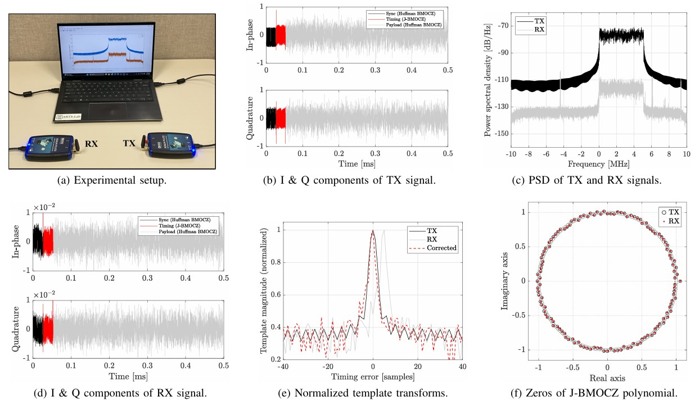

## SDR Demo

This folder contains a MATLAB live script that walks through an SDR implementation of a non-coherent and pilot-free BMOCZ-based OFDM transceiver. The demo assumes you have ADALM-PLUTO SDRs, though it can be readily edited for use with other SDRs.

   
  <b>Figure 1.</b> Example SDR demo results in "Jutted BMOCZ for Non-Coherent OFDM".

