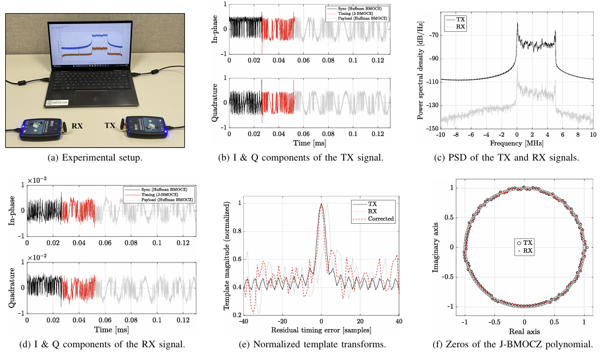

## Software-defined Radio Demo

This folder contains a MATLAB live script that walks through the SDR implementation of non-coherent OFDM-BMOCZ presented in "Jutted BMOCZ for Non-Coherent OFDM". 

The demo uses ADALM-PLUTO SDRs and MATLAB's "Communications Toolbox Support Package for Analog Devices ADALM-Pluto Radio". However, the demo can be edited for use with other SDRs by simply changing the relevant lines in `mainSDRdemo.mlx`.

   
  <b>Figure 1.</b> Example demo results in "Jutted BMOCZ for Non-Coherent OFDM".

